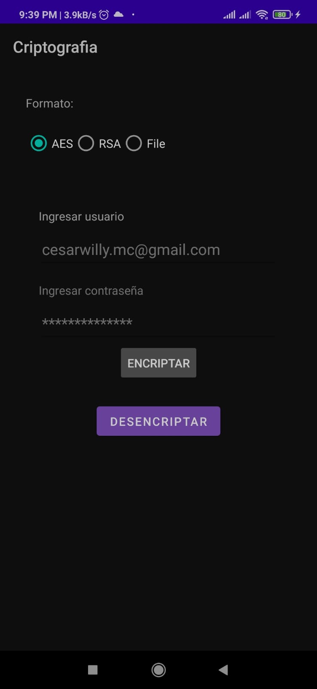
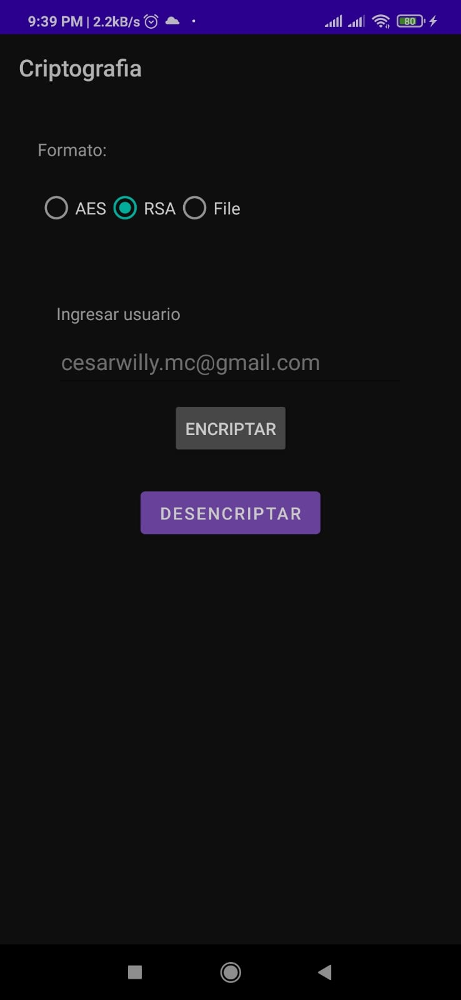
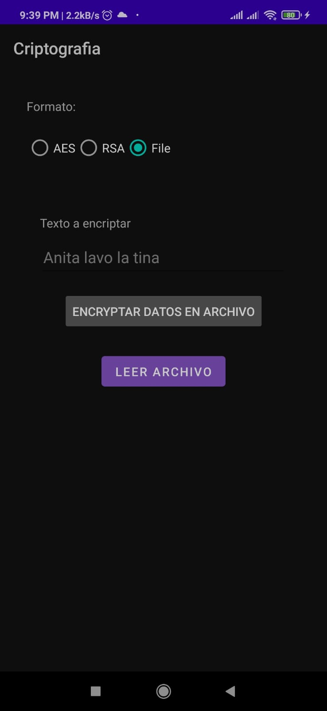

# Encrypt Proyect

In this proyect, I am using 2 forms of encrypted, RSA, AES.

| Mode| APP| 
| ----- | ---- |
| AES | 
| RSA | 
| FILE| 

## ENCRYPT RSA

with rsa we use a private and public key to obtain encryption data, as we see in the following code.

### Encrypt

```kotlin
    override fun encrypt(word: String, publicKey: Key): String {
    
        val cipher = Cipher.getInstance(optionRSA)
        cipher.init(Cipher.ENCRYPT_MODE, publicKey)
        val dataEncryptedByte = cipher.doFinal(word.toByteArray())
        return Base64.encodeToString(dataEncryptedByte, Base64.DEFAULT)
    }

```

### De encrypt

```kotlin
    override fun deEncrypt(wordEncrypt: String, privateKey: Key): String {

        val cipher = Cipher.getInstance(optionRSA)
        cipher.init(Cipher.DECRYPT_MODE, privateKey)
        val dataDeEncrypt = Base64.decode(wordEncrypt, Base64.DEFAULT)
        val dataDeEncryptByte = cipher.doFinal(dataDeEncrypt)
        return String(dataDeEncryptByte)
    }

```

## ENCRYPT AES
for aes we only have a password to encrypt and decrypt data.
### Encrypt

```kotlin
    override fun encrypt(word: String, password: String): String {
        val secretKey = generateKey(password)
        val cipher = Cipher.getInstance(aesConst)
        cipher.init(Cipher.ENCRYPT_MODE, secretKey)
        val dataEncryptedByte = cipher.doFinal(word.toByteArray())
        return Base64.encodeToString(dataEncryptedByte, Base64.DEFAULT)
    }

```

### De encrypt

```kotlin
    override fun deEncrypt(wordEncrypt: String, password: String): String {
        val secretKey = generateKey(password)
        val cipher = Cipher.getInstance(aesConst)
        cipher.init(Cipher.DECRYPT_MODE, secretKey)
        val dataDeEncrypt = Base64.decode(wordEncrypt, Base64.DEFAULT)
        val dataDeEncryptByte = cipher.doFinal(dataDeEncrypt)
        return String(dataDeEncryptByte)
    }

```

## ENCRYPT FILE
To encrypt files, we have to define how the file will be encrypted, assign a path and the text to encrypt, are the data necessary to do it.
But do not forget you must have permissions to edit and create files, you must put it in the manifest


## ENCRYPT SHARED PREFERENCE

To use shared preferences with encryption, you must use the jetpack compose library, since it makes it much easier, you just have to wrap your shared preference instance inside EncryptedSharedPreferences and this will solve all your problems.
Don't forget to assign a way to encrypt your data.

```kotlin
     val masterKey = MasterKey.Builder(App.getContextApp())
        .setKeyScheme(MasterKey.KeyScheme.AES256_GCM)
        .build()

     EncryptedSharedPreferences.create(
            App.getContextApp(),
            BuildConfig.SHARED_PREFERENCE_NAME,
            masterKey,
            EncryptedSharedPreferences.PrefKeyEncryptionScheme.AES256_SIV,
            EncryptedSharedPreferences.PrefValueEncryptionScheme.AES256_GCM
    )

```